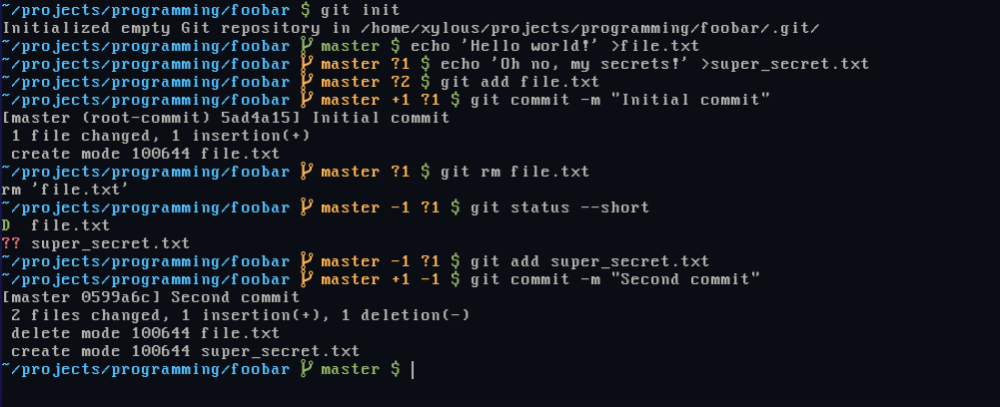

# gitstatus

`gitstatus` is a plugin made for prompts - it tells you how many things have
changed since the last git commit in a repository.

Example with `PS1='%F{blue}%~%F{default} $(gitstatus -i)%F{green}$%F{default} '`:



## Why such a thing?

Frankly, it's because I needed something small and fast that would integrate
well with my (multi-line) prompt.

Is it useful? For me and probably a handful other people, yes.

## Getting Started

### Requirements

- zsh
- git
- awk

### Installation

#### Manual

Clone this repository locally, on your machine, for example:

```
git clone "https://github.com/xylous/gitstatus.git" gitstatus
```

```zsh
source /path/to/installation/gitstatus.plugin.zsh
```

And of course, remember to replace `/path/to/installation` with the actual path
to the program.

#### With a plugin manager

You could also use a plugin manager, such as zpm:

```
zpm load xylous/gitstatus
```

## Usage

Change your prompt to include `$(gitstatus)` wherever you need. Note that you'll
need to `setopt PROMPT_SUBST` and that you're going to need to use single
quotes.

So, for example:

```zsh
setopt PROMPT_SUBST
PROMPT='%F{blue}%~%F{default} $(gitstatus -i)$ '
```

### Options

- `-i`: use if your prompt is inline. It appends a whitespace character if the
output is non-empty; the formatting will always be proper, even if outside a git
repository.

## Roadmap

- [x] add screenshots
- [x] have better support for inline prompts
- [ ] cover more `git status` flags

## Contributing

Pull requests and issues are welcome.
